# At 200 km/h, a legal tennis serve has a 1.5° launch window

### The serve admissibility envelope — how speed, spin, and direction constrain the set of physically legal serves


A tennis serve has to clear a net and land inside a 6.40 m × 4.115 m box roughly 18.29 m away, after about half a second of nonlinear aerodynamic flight. This repository asks a question about the **feasible set** rather than about any single trajectory:

> **Given a serve speed and spin state, which launch conditions can physically produce a legal serve at all?**

The answer is a constrained region in launch-condition space — the **admissibility envelope** — bounded by two curves that close in on each other as the serve gets faster or wider.

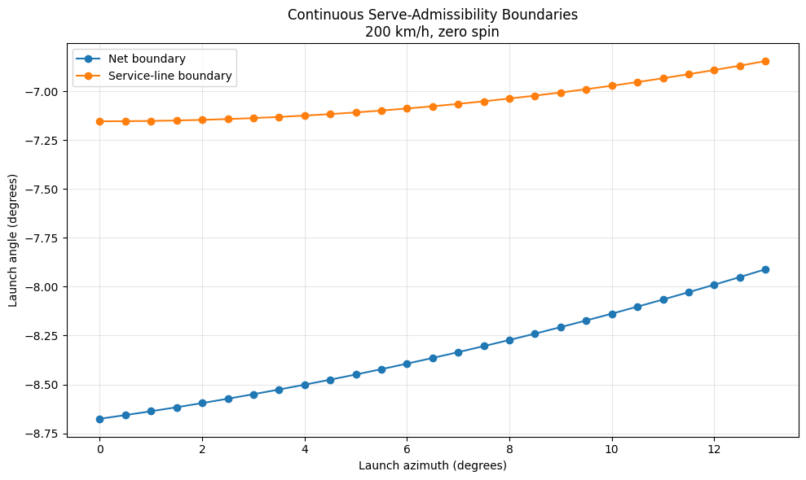

The lower curve is where the ball stops clearing the net. The upper curve is where it starts landing past the service line. Everything between them is legal. This project is a study of how that gap behaves.

---

## Why I built this

I built this during the **2026 US Open**, because watching the biggest servers in the world made me want to know what the physics actually permits at those speeds. The fastest first serve in the 2024 point-by-point data is 230 km/h, and the question that started the whole thing was simple: at that speed, how much room is there to miss?

Under this model, about 1.4 degrees. Roughly the angular width of a pencil held at arm's length.

**US Open 2026 — go Ben Shelton!!**

---

## Key result

Under the baseline model (3.0 m contact height, zero spin, $C_D = 0.55$), the admissible launch-angle window narrows monotonically with serve speed:

| Serve speed | Net boundary | Service-line boundary | **Admissible width** |
|---:|---:|---:|---:|
| 160 km/h | −7.960° | −5.944° | **2.016°** |
| 170 km/h | −8.187° | −6.327° | **1.860°** |
| 180 km/h | −8.377° | −6.648° | **1.729°** |
| 190 km/h | −8.538° | −6.920° | **1.618°** |
| 200 km/h | −8.676° | −7.153° | **1.523°** |
| 210 km/h | −8.794° | −7.353° | **1.441°** |
| 220 km/h | −8.897° | −7.527° | **1.370°** |

**A 32.05% contraction across a 60 km/h increase**, averaging −0.108° per 10 km/h. A quadratic fit describes the modeled range with $R^2 = 0.99976$ and a maximum residual of 0.004°.

Two other parameters move the window further than speed does:

| Effect | Range tested | Width response |
|---|---|---|
| **Spin** | −2500 → +2500 rpm | 0.561° → 2.490° |
| **Direction** | 0° → 13° azimuth | 1.523° → ~0.7°, closing near 13.8° |
| **Speed** | 160 → 220 km/h | 2.016° → 1.370° |

These are **model-response results**, not universal physical laws, and none of them is a serve-success probability. See [What this does not claim](#what-this-does-not-claim).

---

## Contents

- [The physical model](#the-physical-model)
- [Court geometry and constraints](#court-geometry-and-constraints)
- [Numerical methods](#numerical-methods)
- [Verification](#verification)
- [Results](#results)
- [Empirical context: US Open data](#empirical-context-us-open-data)
- [What this does not claim](#what-this-does-not-claim)
- [Reproducing](#reproducing)
- [Repository structure](#repository-structure)
- [Open items](#open-items)
- [References](#references)

---

## The physical model

The ball is treated as a particle under gravity, quadratic aerodynamic drag, and Magnus lift:

$$
m\dot{\mathbf{v}} = m\mathbf{g} - \tfrac{1}{2}\rho A C_D \lVert\mathbf{v}\rVert\mathbf{v} + \tfrac{1}{2}\rho A C_L \lVert\mathbf{v}\rVert^{2}\left(\hat{\boldsymbol\omega}\times\hat{\mathbf{v}}\right)
$$

Both aerodynamic terms are nonlinear in speed, so once drag is active there is no closed-form trajectory and the problem becomes genuinely numerical.

**Drag.** Always opposes the instantaneous velocity vector:

$$
\mathbf{a}_D = -\frac{\rho A C_D}{2m}\lVert\mathbf{v}\rVert\mathbf{v}
$$

**Magnus.** Acts perpendicular to both the spin axis and the velocity direction, with a provisional spin-ratio lift coefficient:

$$
C_L = \frac{1}{2 + v/v_{\mathrm{spin}}}, \qquad v_{\mathrm{spin}} = r\lVert\boldsymbol\omega\rVert
$$

Spin is entered in rpm and converted before reaching the physics:

$$
\omega_{\mathrm{rad/s}} = \omega_{\mathrm{rpm}} \cdot \frac{2\pi}{60}
$$

### Baseline parameters

| Parameter | Symbol | Value | Units |
|---|:---:|---:|---|
| Ball mass | $m$ | 0.0575 | kg |
| Ball diameter | $d$ | 0.067 | m |
| Ball radius | $r$ | 0.0335 | m |
| Cross-sectional area | $A$ | 3.526 × 10⁻³ | m² |
| Air density | $\rho$ | 1.21 | kg/m³ |
| Drag coefficient | $C_D$ | 0.55 | – |
| Gravity | $g$ | 9.81 | m/s² |
| Contact height | $h$ | 3.0 | m |
| Nominal serve speed | $v_0$ | 200 | km/h |

$C_D$ and the $C_L$ law are **provisional modeling parameters**, not measured constants. Real tennis-ball aerodynamics vary with Reynolds number, spin parameter, ball condition, and surface wear. Every spin- and drag-dependent result below is a result *of this model*.

---

## Court geometry and constraints

Coordinates: $x$ runs from the server toward the net, $y$ is lateral with $y = 0$ on the centre service line, $z$ is vertical. The net plane sits at $x = 0$, and contact occurs at $x = -11.885$ m.

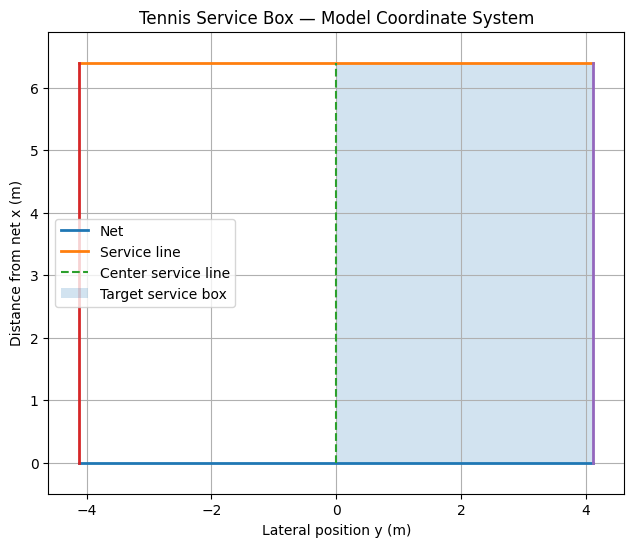

| Quantity | Value |
|---|---:|
| Baseline to net | 11.885 m |
| Net to service line | 6.40 m |
| Net height, centre | 0.914 m |
| Net height, posts | 1.07 m |
| Service box width | 4.115 m |
| Service box depth | 6.40 m |

A trajectory is **legal** only if all three constraints hold simultaneously.

**1. Net clearance.** At the net crossing,

$$
z_{\mathrm{net}} > h_{\mathrm{net}}(y_{\mathrm{net}})
$$

where $h_{\mathrm{net}}$ interpolates linearly from 0.914 m at centre to 1.07 m at the posts.

**2. Service depth.** The first bounce lands short of the service line,

$$
0 < x_{\mathrm{land}} < 6.40
$$

**3. Lateral bound.** The bounce lands inside the correct box,

$$
0 \le y_{\mathrm{land}} \le 4.115 \ \text{(deuce)}, \qquad -4.115 \le y_{\mathrm{land}} \le 0 \ \text{(ad)}
$$

The admissible set is then

$$
\mathcal{A}(v,\boldsymbol\omega,h) = \left\{(\theta,\phi) : \text{all three constraints satisfied}\right\}
$$

with $\theta$ the launch elevation and $\phi$ the azimuth. Its **boundary** is the primary computational object of this project.

---

## Numerical methods

Trajectories are integrated with SciPy using event detection to locate the net crossing and the first bounce, rather than checking sign changes at fixed steps — event localisation accurate to $O(\Delta t)$ would destroy the smoothness the root solver depends on.

Boundaries are found by **bracketed Brent root-finding** on the constraint residuals. The boundary is the launch angle at which net clearance or landing distance crosses zero:

<p align="center">
  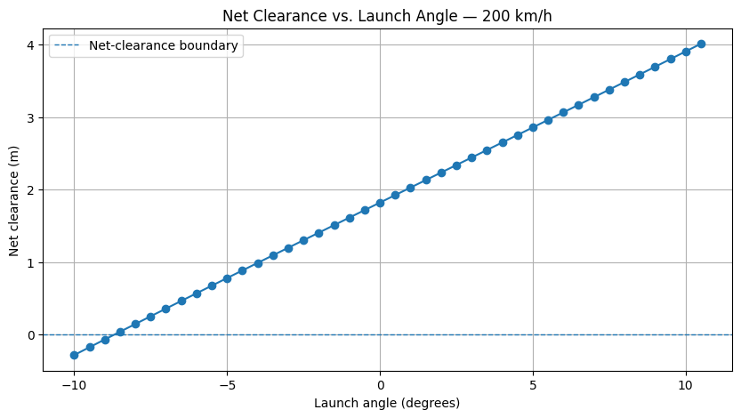
  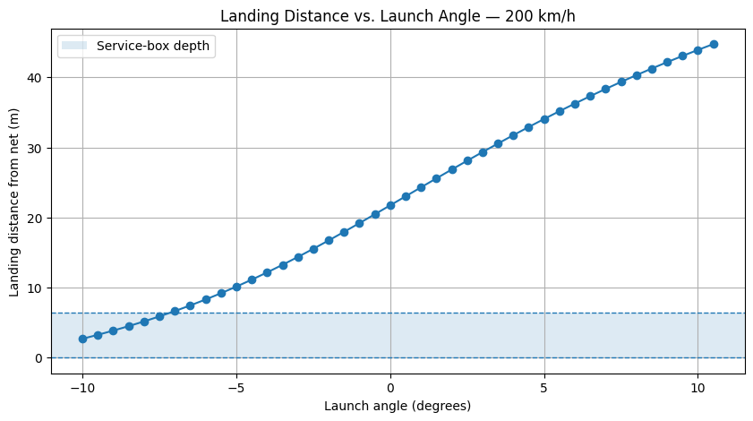
</p>

Both residuals are smooth and monotone in launch angle over the bracketing interval, which is what makes the solve reliable. The workflow is:

```
physical constants → initial serve state → nonlinear equations of motion
        → numerical trajectory → net crossing event → first bounce event
        → constraint evaluation → boundary root solve
        → parameter sweep (speed, spin, azimuth) → robustness analysis
```

---

## Verification

Nothing about serves was trusted until the numerical machinery was validated against problems with known answers.

### Analytical agreement

Gravity-only trajectories match the closed-form projectile solution to floating-point precision:

```
x error:  3.55 × 10⁻¹⁴ m
z error:  6.66 × 10⁻¹⁵ m
```

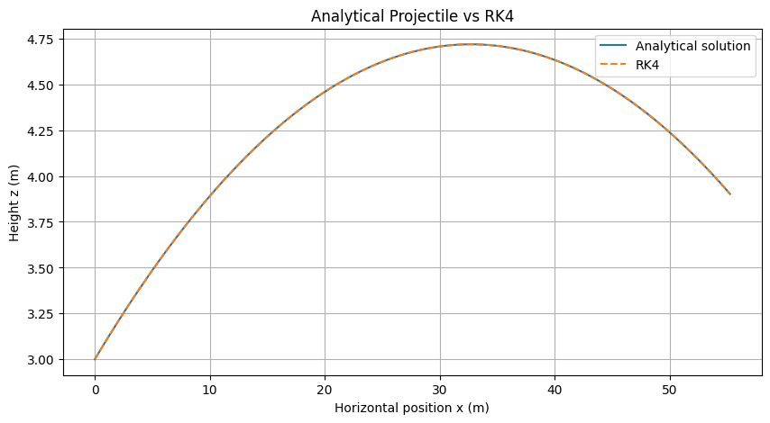

### Convergence order

On the nonlinear benchmark $y' = -y^2$, measured convergence orders were 3.867, 3.967, 3.994, 3.998 — a mean of **3.957**, consistent with fourth-order Runge–Kutta. The observed order is computed as

$$
p = \frac{\log(E_1/E_2)}{\log(\Delta t_1/\Delta t_2)}
$$

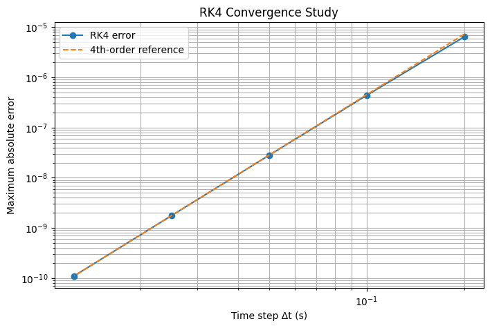

### Drag

Initial drag force was checked by hand at 200 km/h: **3.62 N**, matching $\tfrac{1}{2}\rho A C_D v^2$. A monotonicity test confirmed that increasing $C_D$ reduces landing distance. On a high-speed benchmark, enabling drag reduced range from 86.90 m to 48.13 m — a **44.6% reduction**.

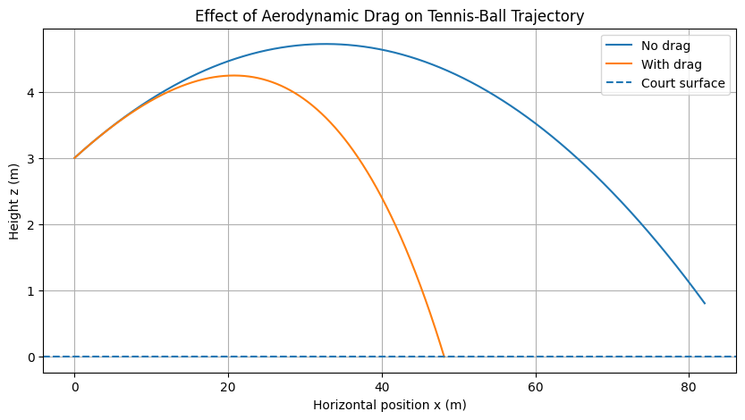

### Magnus

The 3D implementation was tested against known cross-product directions on principal spin axes. For $\mathbf{v} = [55.56, 0, 0]$ m/s and $\boldsymbol\omega = [0, 100, 0]$ rad/s, the Magnus acceleration is vertically downward — confirming that **positive $\omega_y$ is topspin** in this convention.

<p align="center">
  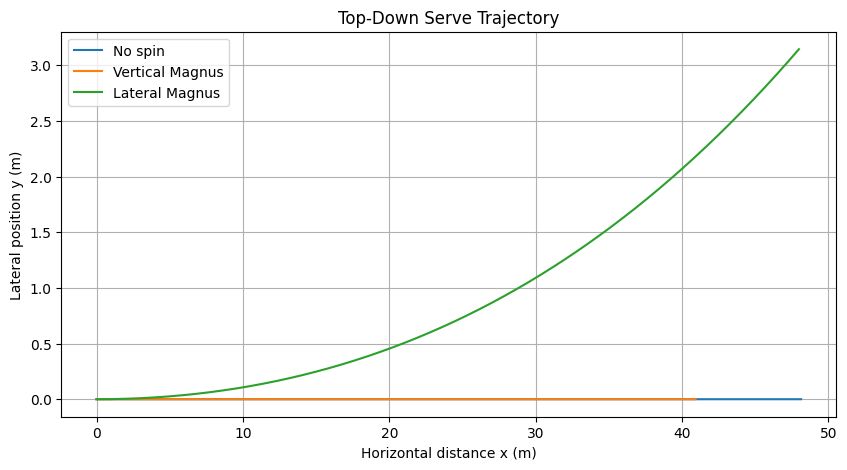
  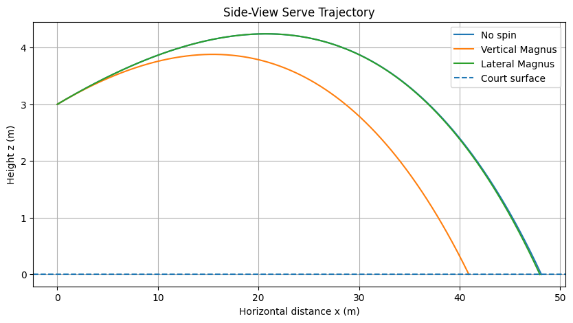
</p>

Lateral spin curves the trajectory sideways; vertical spin shortens it. Zero spin reproduces the drag-only trajectory exactly.

### Internal consistency

At zero azimuth, the 2D boundary computation reproduces the independently computed 1D boundaries to better than $3.8\times10^{-7}$ degrees (net) and $9.3\times10^{-8}$ degrees (service line). Spin reversal is symmetric to within 0.006°. These cross-checks test two different computational pathways against each other.

The automated suite contains **37 tests**, all passing, run on every push through GitHub Actions.

---

## Results

### The one-dimensional window

At fixed speed, spin, and azimuth, the admissible set collapses to an interval in launch angle:

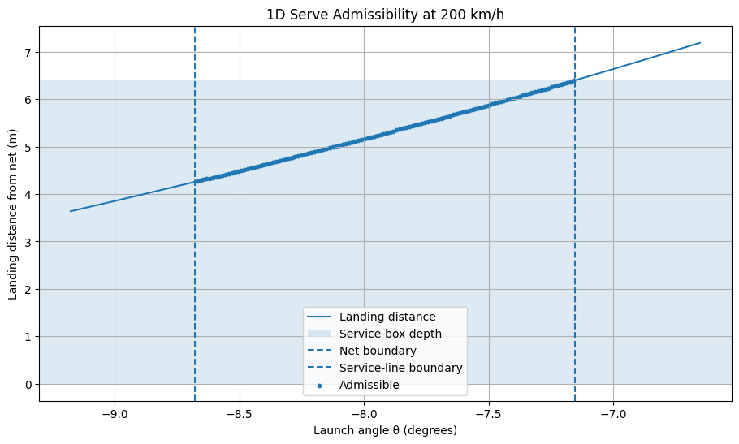

For the baseline 200 km/h, zero-spin, zero-azimuth case:

```
Net boundary:      -8.675886°
Service boundary:  -7.152987°
Admissible width:   1.522899°
```

### The two-dimensional envelope

Adding azimuth gives a genuine 2D region. It is a wedge, widest at the centre line and tapering as the serve goes wider, pinching shut near 13.8°:

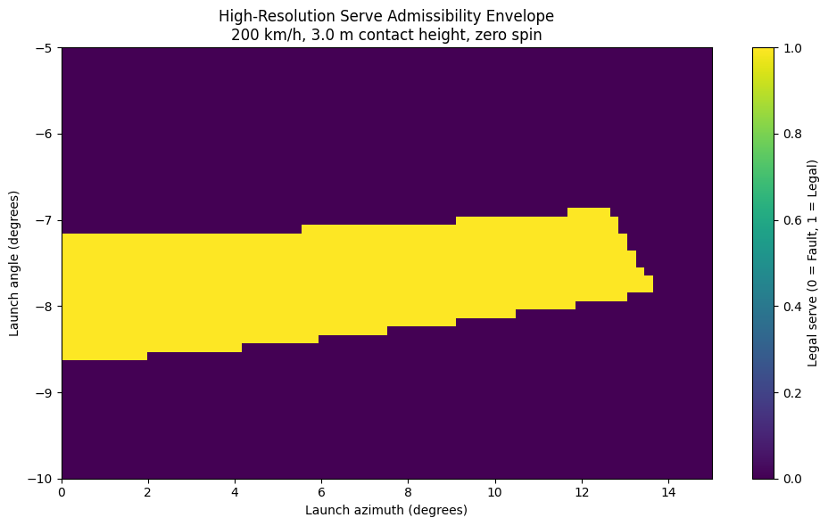

### Speed narrows the window

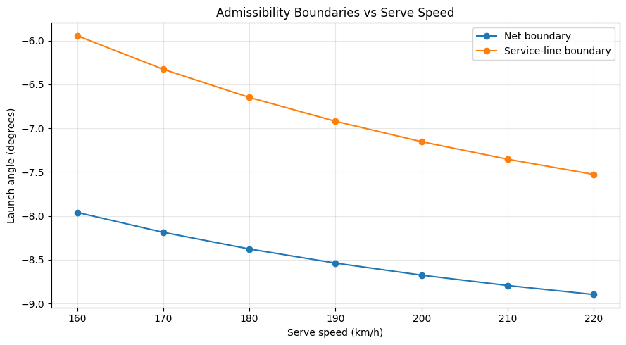

Both boundaries steepen as speed rises, but not equally. Across 160–220 km/h the net boundary moves 0.94° while the service-line boundary moves 1.58°, so the gap closes from the shallow side. **Faster serves are constrained more by landing long than by clipping the net.**

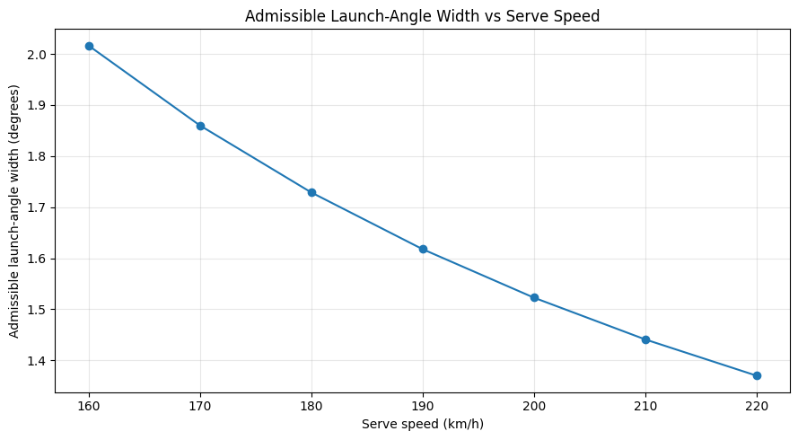

The maximum admissible azimuth tightens with speed as well — the fastest serves cannot be aimed as wide:

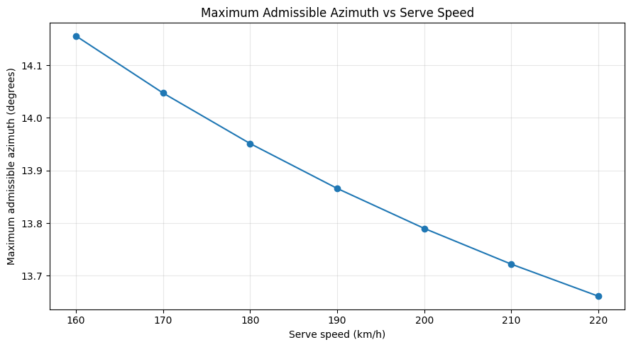

### Spin reshapes it

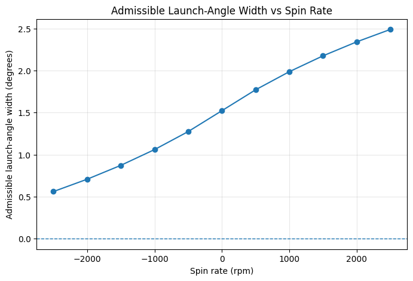

Positive values denote **topspin**.

| Spin (rpm) | Net boundary | Service boundary | Width |
|---:|---:|---:|---:|
| −2500 | −10.313° | −9.752° | 0.561° |
| −2000 | −10.056° | −9.348° | 0.708° |
| −1500 | −9.770° | −8.897° | 0.873° |
| −1000 | −9.449° | −8.389° | 1.060° |
| −500 | −9.087° | −7.813° | 1.275° |
| **0** | **−8.676°** | **−7.153°** | **1.523°** |
| +500 | −8.264° | −6.493° | 1.771° |
| +1000 | −7.902° | −5.915° | 1.987° |
| +1500 | −7.581° | −5.406° | 2.175° |
| +2000 | −7.295° | −4.953° | 2.342° |
| +2500 | −7.038° | −4.548° | 2.490° |

Topspin bends the trajectory downward, permitting a flatter launch that still lands short of the service line — so the window widens from both sides at once:

<p align="center">
  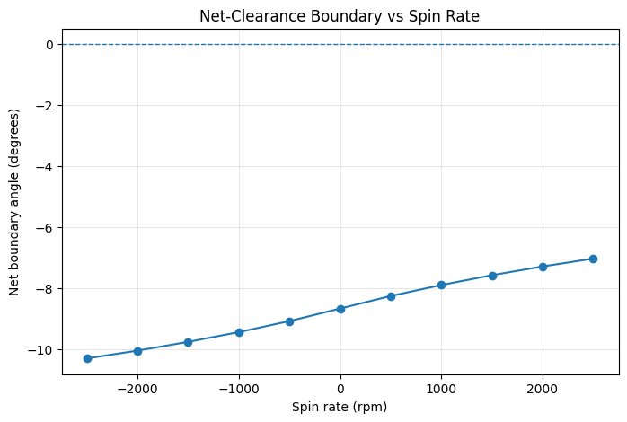
  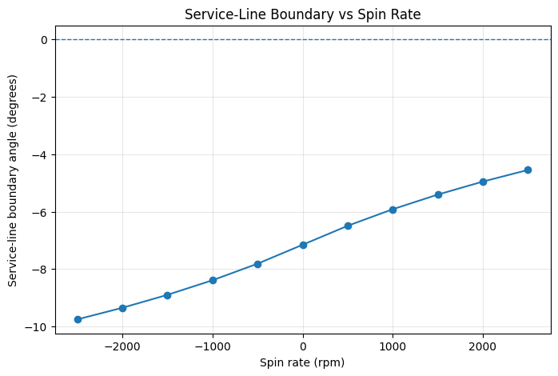
</p>

Across the tested range the response is approximately linear, which is a property of this interval and not a general law.

> **Range caveat.** The symmetric ±2500 rpm sweep is a model-response experiment. Real first serves carry roughly 1500–2500 rpm and kick serves 4000–5000 rpm; sustained 2500 rpm of backspin does not occur on a serve.

### Serving wide costs margin

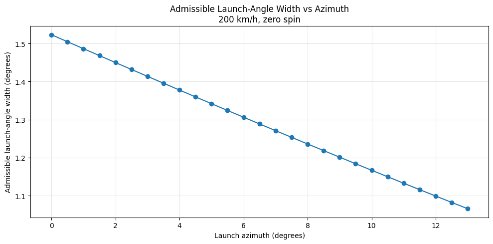

Width falls roughly linearly with lateral launch direction, from 1.523° at zero azimuth to about 0.7° at 13° — a **larger relative effect than the entire 60 km/h speed sweep**. The envelope closes entirely near 13.8°, defining a maximum admissible azimuth.

### A null result worth reporting

Spin barely moves that maximum azimuth. Across the full ±2500 rpm range it shifts by roughly **0.005°**:

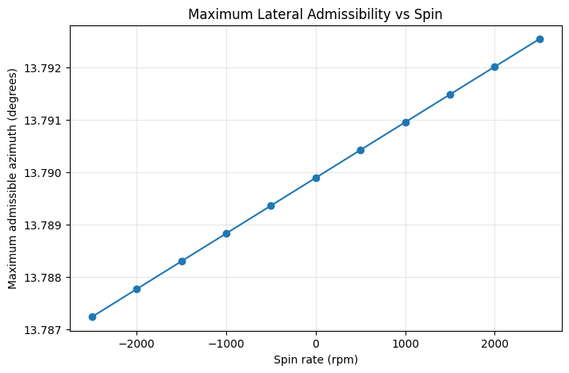

The y-axis here spans five thousandths of a degree, so the apparent trend is effectively flat. Spin changes how much angular room you have; it does not meaningfully change how wide you can aim.

### Which constraints actually bind

Across every tested configuration, the binding constraints were **net clearance** and the **service line**. The lateral bound $|y_{\mathrm{land}}| \le 4.115$ never became active in the modeled range. Serve legality in this regime is a two-constraint problem in practice, and the widest possible serve is set by those two boundaries meeting rather than by the sideline.

### Legality is not robustness

A nominally legal serve can sit arbitrarily close to a boundary. A full factorial perturbation over speed, launch angle, azimuth, contact height, and spin (243 cases, $3^5$) around a nominal legal serve gave:

```
Nominal state:     200 km/h, 3.0 m, θ = -7.914436°, φ = 6.883538°, 0 rpm
Nominal clearance: +0.0918 m
Legal cases:       199 / 243
Robustness rate:   81.89%
Worst clearance:   -0.0896 m
```

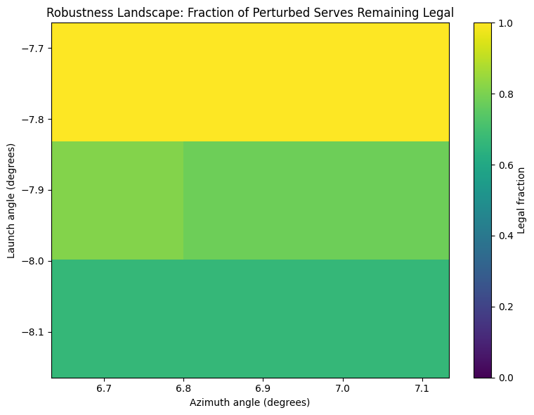

**Every one of the 44 failures was a net-clearance failure.**

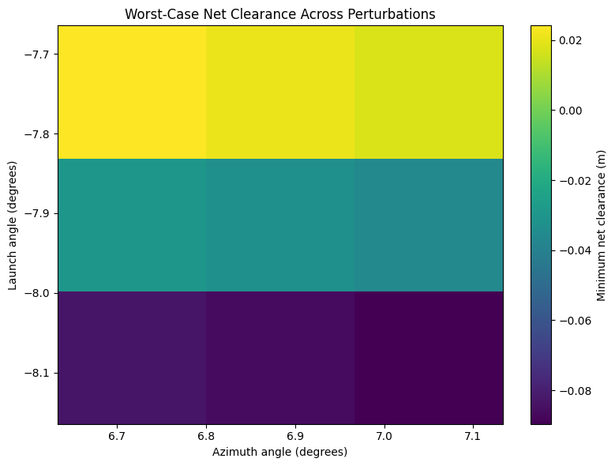

| Parameter | Marginal effect |
|---|---:|
| Contact height | 54.3 pp |
| Launch angle | 33.3 pp |
| Spin | 11.1 pp |
| Speed | 1.2 pp |
| Azimuth | 1.2 pp |

Contact height dominating is consistent with it setting the geometry of the entire net-clearance problem. These are effects **within the specified perturbation design**, not global variance decompositions.

> **Known caveat.** The nominal launch angle (−7.9144°) is the midpoint of the $\phi = 0$ admissible interval but was evaluated at $\phi = 6.88°$. Because the interval shifts with azimuth, the nominal point is not exactly max-margin there, which partly explains why all failures fall on the net side. Recomputing the max-margin point per azimuth is an open item.

---

## Empirical context: US Open data

The model is placed against real serve speeds using Grand Slam point-by-point data. This is **context, not validation** — the dataset contains no launch angle, spin, or contact height, so no individual simulated trajectory can be checked against it.

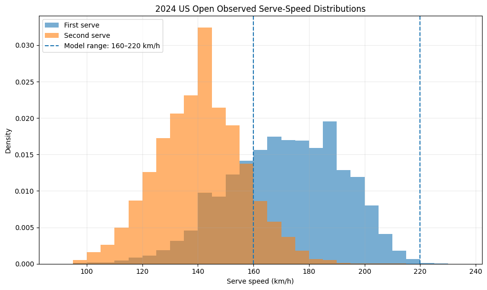

From 45,289 rows (44,783 point records, 506 per-match metadata rows):

| | First serve | Second serve |
|---|---:|---:|
| Valid speed records | 25,528 | 16,074 |
| Mean | 171.1 km/h | 140.3 km/h |
| Median | 172 km/h | 140 km/h |
| Standard deviation | 20.6 km/h | 15.7 km/h |
| Minimum | 96 km/h | 98 km/h |
| Maximum | **230 km/h** | 214 km/h |

Median first–second difference: **32 km/h** (bootstrap 95% CI [31, 32]), Cohen's $d = 1.63$, two-sample KS $D = 0.607$, $p < 0.001$.

Reconstructed first-serve-in rate:

$$
\frac{25{,}909}{25{,}909 + 16{,}365 + 2{,}509} = \mathbf{57.85\%}
$$

which serves as an external sanity check on the serve accounting.

**70.96%** of successful first serves fall between 160 and 220 km/h — the same band as the computational sweep, which is what makes the modeled range relevant rather than arbitrary.

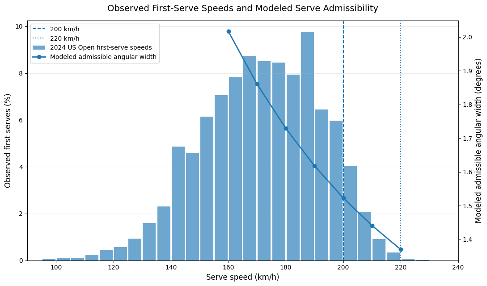

> **Open item.** These statistics pool men's and women's matches. The two distributions differ by roughly 26 km/h, so the reported mean is a two-component mixture and the standard deviation is inflated by the between-tour gap. Tour can be recovered from the `match_id` block or by joining `2024-usopen-matches.csv`. Splitting by tour is the highest-value next step, particularly because contact height — the most influential parameter in the robustness analysis — differs by roughly 25 cm between tours.

### Why a direct success-rate test is impossible

The dataset records the speed of the serve that was *played*, not of every serve *attempted*. When a first serve faults, the point record carries the second serve's speed and the faulted first serve has no speed at all. The denominator required for

$$
P(\text{first serve in} \mid v)
$$

therefore does not exist in this data. Reporting the successful-serve speed distribution as if it were a conditional success curve would be wrong, and this project does not do it.

---

## What this does not claim

**This is not a serve-success probability.** Admissible angular width is a geometric quantity. Players do not sample launch angles uniformly; motor variability, targeting, and strategy are all outside the model.

$$
\text{admissible width} \ne P(\text{serve in})
$$

**This is not a biomechanical model.** It begins at ball contact. Racket mechanics, pronation, joint torques, ball–racket collision, racket deformation, and energy transfer from the player are all excluded.

**This does not reconstruct professional trajectories.** The point-by-point data lack the launch state required. Eassom, Robertson & Reid (2026) demonstrate that reconstruction is achievable with full spatiotemporal tracking; this project addresses the complementary forward problem.

**The aerodynamics are simplified.** Constant $C_D$, a provisional $C_L$ law, no wind, no temperature, humidity, or altitude effects, and a simplified lateral net-height interpolation.

**Results are separated by evidence type throughout.** Model-derived quantities (widths, boundaries, robustness rates) depend on the stated physical assumptions. Data-derived quantities (speed distributions, percentiles, in-rate) depend on the external dataset. The two are never conflated.

---

## Reproducing

```bash
git clone https://github.com/ManveerTib/tennis-serve-admissibility
cd tennis-serve-admissibility
python -m venv .venv && source .venv/bin/activate
pip install -r requirements.txt
python -m pytest -q          # 37 passed
```

Run the notebooks in order:

| Notebook | Stage |
|---|---|
| `01_projectile_verification` | Analytical agreement, RK4 convergence |
| `02_aerodynamic_drag` | Quadratic drag, force and range checks |
| `03_magnus_3d` | 3D spin dynamics, direction verification |
| `04_court_geometry` | Net, service line, box constraints |
| `05_admissibility_envelope` | Boundary solve, 1D and 2D envelope |
| `06_speed_dependent_envelope` | Speed and azimuth sweeps |
| `07_spin_dependent_envelope` | Spin sweep, spin–azimuth landscape |
| `08_robustness_uncertainty` | Factorial perturbation study |
| `09_usopen_empirical_analysis` | Serve-speed distributions |
| `10_scientific_synthesis` | Combined interpretation |

The empirical notebook requires `2024-usopen-points.csv` from Jeff Sackmann's `tennis_slam_pointbypoint`, which is **not redistributed here**. See [`data/README.md`](data/README.md) for provenance and CC BY-NC-SA terms.

---

## Repository structure

```
tennis-serve-admissibility/
│
├── README.md
├── research_note.md          # full derivations and extended discussion
├── requirements.txt
├── LICENSE
│
├── src/
│   ├── constants.py          # ITF geometry, ball spec, air properties
│   ├── aerodynamics.py       # drag and Magnus accelerations
│   ├── trajectory.py         # integration with event detection
│   ├── constraints.py        # net / depth / lateral residuals
│   ├── boundary_solver.py    # Brent boundary solves, parameter sweeps
│   ├── sensitivity.py        # perturbation design, marginal effects
│   ├── inference.py          # empirical estimation
│   └── validation.py         # analytical and consistency checks
│
├── notebooks/                # 10 sequential experiments
├── tests/                    # 37 tests, run in CI
│
├── figures/
│   ├── main/                 # headline figures
│   └── supporting/           # verification and analysis figures
│
├── data/README.md            # external data provenance
└── .github/workflows/        # continuous integration
```

---

## Open items

Tracked openly rather than hidden:

- [ ] Split empirical statistics by tour (`match_id` block or matches-file join)
- [ ] Recompute the robustness nominal point as max-margin at its own azimuth
- [ ] Narrow the spin sweep to a physically realistic serve range
- [ ] Report admissible **area** in deg² from the traced boundary, not just 1D width
- [ ] Re-verify the spin × azimuth map against the 1D solver and restore the heatmap
- [ ] Move the 3D trajectory model out of the notebooks and into `src/` so the test suite covers it
- [ ] Re-render figures at higher DPI with categorical colormaps for binary fields
- [ ] Restore `00_usopen_data_audit.ipynb` (referenced in the write-up, not yet committed)

---

## References

**ITF.** *Rules of Tennis.* Court dimensions, service-line location, and net geometry used as the basis for the computational court model.

**Goodwill, S. R., Chin, S. B., & Haake, S. J.** (2004). Aerodynamics of spinning and non-spinning tennis balls. *Journal of Wind Engineering and Industrial Aerodynamics*, 92(11). [`10.1016/j.jweia.2004.05.004`](https://doi.org/10.1016/j.jweia.2004.05.004)

**Eassom, A., Robertson, S., & Reid, M.** (2026). Tennis ball trajectory decomposition based on spatiotemporal tracking data. *Sports Engineering*, 29:19. [`10.1007/s12283-026-00547-6`](https://doi.org/10.1007/s12283-026-00547-6)

**Sackmann, J.** *tennis_slam_pointbypoint.* Grand Slam point-by-point data, 2011–present. CC BY-NC-SA 4.0.

---

## Author

**Manveer Singh Tib** · 2026

Full derivations, verification detail, robustness checks, and extended discussion are in [`research_note.md`](research_note.md).

**Status.** Physical model, numerical verification, envelope analysis, and empirical context are implemented and tested. Open items above are in progress. A formal write-up is planned as a subsequent stage.

---

---

<p align="center">
  
</p>

<p align="center">
  <em>Built during the 2026 US Open. Go Ben Shelton!!</em>
</p>
